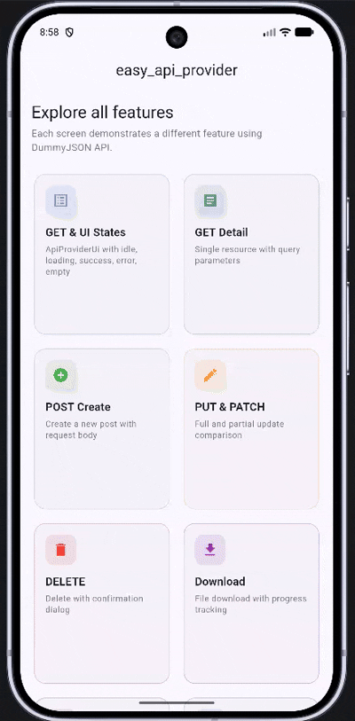

# easy_api_provider — Flutter REST API Client & API Provider

[](https://pub.dev/packages/easy_api_provider)
[](https://pub.dev/packages/easy_api_provider/score)
[](https://github.com/k-achraf/api_provider/blob/main/LICENSE)
[](https://flutter.dev)

`easy_api_provider` is a lightweight **Flutter API provider** and **REST API client** built on [Dio](https://pub.dev/packages/dio). It wraps every HTTP API call with built-in **UI state management**, so you stop writing repetitive loading, success, error, and empty widget logic by hand.

## Why easy_api_provider?

| Without easy_api_provider | With easy_api_provider |
|---|---|
| Manual try/catch on every request | Automatic error handling, no exceptions thrown |
| Build your own loading/success/error UI | Built-in `ApiProviderUi` widget with animated transitions |
| Duplicate Dio setup across projects | Singleton `ApiProvider` with one-line config |
| Manage API state with boilerplate | `ApiProviderController` handles idle, loading, success, error, empty |
| No request logging out of the box | Colored request/response/error logs via TalkerDioLogger |

## Features

- **All HTTP methods**: GET, POST, PUT, PATCH, DELETE, file download
- **Reactive UI states**: idle, loading, success, error, empty with animated transitions
- **Automatic error handling**: catches DioException, TimeoutException, and unexpected errors
- **No exceptions thrown**: every request returns a typed `ApiResponse` object
- **Request logging**: colored console output for debugging with TalkerDioLogger
- **Interceptor support**: custom onRequest, onResponse, and onError callbacks
- **Authorization management**: set/update/remove auth headers at runtime
- **Query parameters, headers, timeouts**: fully configurable per-request or globally
- **Cancel token support**: cancel in-flight requests
- **Upload/download progress**: track send and receive progress
- **Clean architecture friendly**: works with any state management solution
- **Dart 3 ready**: requires Dart >=3.0.0

## Quick Start

### Installation

Add to your `pubspec.yaml`:

```yaml
dependencies:
  easy_api_provider: ^2.0.0
```

Or run:

```shell
flutter pub add easy_api_provider
```

### Initialize

```dart
import 'package:easy_api_provider/easy_api_provider.dart';

void main() {
  ApiProvider.instance.init(ApiProviderConfig(
    'https://dummyjson.com',
    contentType: 'application/json',
    connectTimeout: const Duration(seconds: 30),
    receiveTimeout: const Duration(seconds: 30),
    headers: {'Accept': 'application/json'},
    requestLogger: true,
  ));

  runApp(const MyApp());
}
```

## Usage

### GET Request

```dart
final ApiResponse response = await ApiProvider.instance.get('/posts');

if (response.success) {
  print(response.data); // List of posts
} else {
  print(response.message); // Error message
}
```

### POST Request

```dart
final ApiResponse response = await ApiProvider.instance.post(
  '/posts/add',
  data: {'title': 'Hello', 'body': 'World', 'userId': 1},
);
```

### PUT Request

```dart
final ApiResponse response = await ApiProvider.instance.put(
  '/posts/1',
  data: {'title': 'Updated Title'},
);
```

### PATCH Request

```dart
final ApiResponse response = await ApiProvider.instance.patch(
  '/posts/1',
  data: {'title': 'Patched Title'},
);
```

### DELETE Request

```dart
final ApiResponse response = await ApiProvider.instance.delete('/posts/1');
```

### File Download

```dart
final ApiResponse response = await ApiProvider.instance.download(
  '/file.pdf',
  '/save/path/file.pdf',
  onReceiveProgress: (received, total) {
    print('$received / $total');
  },
);
```

### Query Parameters

```dart
final ApiResponse response = await ApiProvider.instance.get(
  '/posts',
  params: {'limit': 5, 'skip': 0},
);
```

### Cancel a Request

```dart
final cancelToken = CancelToken();

// Start request
ApiProvider.instance.get('/posts', cancelToken: cancelToken);

// Cancel it
cancelToken.cancel('User cancelled');
```

### Set Authorization Header

```dart
// Set token
ApiProvider.instance.setAuthorisation('Bearer your_token_here');

// Remove token (e.g. on logout)
ApiProvider.instance.setAuthorisation(null);

// Change base URL at runtime
ApiProvider.instance.setBaseUrl('https://api.v2.example.com');
```

### Interceptors

```dart
ApiProvider.instance.init(ApiProviderConfig(
  'https://api.example.com',
  onRequest: (options) {
    print('Request: ${options.method} ${options.path}');
  },
  onResponse: (response) {
    print('Response: ${response.statusCode}');
  },
  onError: (error) {
    print('Error: ${error.message}');
  },
));
```

## UI State Management

`ApiProviderUi` is a widget that automatically switches its child based on the current API state.

### Controller

```dart
final controller = ApiProviderController();
```

### Widget

```dart
ApiProviderUi(
  controller: controller,
  idleWidget: (_) => const Text('Pull to refresh'),
  loadingWidget: (_) => const CircularProgressIndicator(),
  successWidget: (_, response) => Text('${response?.data}'),
  errorWidget: (_, response) => Text('Error: ${response?.message}'),
  emptyWidget: (_) => const Text('No data available'),
);
```

### Auto State Handling

Pass a controller to any API method — the state updates automatically:

```dart
// This sets controller to loading -> then success or error
final response = await ApiProvider.instance.get(
  '/users',
  controller: controller,
);
```

### Listen to State Changes

```dart
controller.listen((status) {
  switch (status) {
    case ApiProviderStatus.loading:
      showSnackBar('Loading...');
    case ApiProviderStatus.success:
      showSnackBar('Done!');
    case ApiProviderStatus.error:
      showSnackBar('Something went wrong');
    default:
      break;
  }
});
```

## API Reference

### ApiResponse

| Property | Type | Description |
|---|---|---|
| `success` | `bool` | Whether the request succeeded |
| `statusCode` | `int?` | HTTP status code (e.g. 200, 404) |
| `data` | `dynamic` | Response body |
| `url` | `String?` | Full request URL |
| `message` | `String?` | Success or error message |

### ApiProviderConfig

| Parameter | Type | Default | Description |
|---|---|---|---|
| `baseUrl` | `String` | required | API base URL |
| `connectTimeout` | `Duration` | 30s | Connection timeout |
| `receiveTimeout` | `Duration` | 30s | Receive timeout |
| `contentType` | `String` | `application/json` | Request content type |
| `responseType` | `ResponseType` | `json` | Expected response type |
| `headers` | `Map?` | null | Default headers |
| `authorization` | `dynamic` | null | Auth header value |
| `requestLogger` | `bool` | `true` | Enable colored logging |
| `maxRedirects` | `int` | `1` | Max HTTP redirects |
| `onRequest` | `Function?` | null | Request interceptor |
| `onResponse` | `Function?` | null | Response interceptor |
| `onError` | `Function?` | null | Error interceptor |
| `listFormat` | `ListFormat?` | null | Query param list format |
| `extra` | `Map?` | null | Extra Dio options |

### ApiProviderStatus

| Value | Description |
|---|---|
| `idle` | No request in progress |
| `loading` | Request is being sent |
| `success` | Response received successfully |
| `error` | Request failed |
| `empty` | Successful but no data |

## Preview



## Example

See the complete example app in [`example/`](https://github.com/k-achraf/api_provider/tree/main/example).

```dart
import 'package:easy_api_provider/easy_api_provider.dart';
import 'package:flutter/material.dart';

void main() {
  ApiProvider.instance.init(ApiProviderConfig(
    'https://dummyjson.com',
    requestLogger: true,
  ));
  runApp(const MyApp());
}

class MyApp extends StatelessWidget {
  const MyApp({super.key});

  @override
  Widget build(BuildContext context) {
    return const MaterialApp(
      home: PostsPage(),
    );
  }
}

class PostsPage extends StatefulWidget {
  const PostsPage({super.key});

  @override
  State<PostsPage> createState() => _PostsPageState();
}

class _PostsPageState extends State<PostsPage> {
  final controller = ApiProviderController();

  @override
  void initState() {
    super.initState();
    ApiProvider.instance.get('/posts', params: {'limit': '10'}, controller: controller);
  }

  @override
  Widget build(BuildContext context) {
    return Scaffold(
      appBar: AppBar(title: const Text('Posts')),
      body: ApiProviderUi(
        controller: controller,
        loadingWidget: (_) => const Center(child: CircularProgressIndicator()),
        successWidget: (_, response) {
          final posts = (response?.data as Map?)?['posts'] as List? ?? [];
          return ListView.builder(
          itemCount: posts.length,
          itemBuilder: (_, i) {
            final post = posts[i];
            return ListTile(title: Text(post['title']));
          },
        ),
        errorWidget: (_, response) => Center(
          child: Text('Error: ${response?.message}'),
        ),
        emptyWidget: (_) => const Center(child: Text('No posts')),
      ),
    );
  }
}
```

## Changelog

See [CHANGELOG.md](https://github.com/k-achraf/api_provider/blob/main/CHANGELOG.md) for release history.

## Contributing

Pull requests are welcome! Please open an issue first to discuss what you would like to change.

## License

This project is licensed under the MIT License — see the [LICENSE](https://github.com/k-achraf/api_provider/blob/main/LICENSE) file for details.